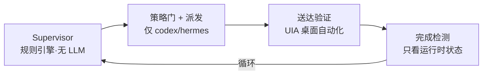

# AutoPilot 全自动化优化分析

> 日期：2026-09-01
> 目的：把「AI 托管」功能往「全自动、少输入、跨 Agent 交接、无人值守」方向优化，梳理现状、缺口与优化点。
> 范围：仅分析，不含代码改动。

## 1. 目标（用户诉求）

1. AI 托管更智能，能循环把任务做完，尽量不打扰用户。
2. 新建 AI 托管任务，用户填最少的东西即可启动。
3. 单个任务由 AI 在 Codex / Claude Code / WorkBuddy 之间自动交接，**AI 代替用户承担「审核」身份**，不经人工。
4. 交接顺滑、进度可监控、最大限度解忧。

## 2. 结论速览（TL;DR）

- **已经跑通且扎实**：Task Intake 自动生成契约（只填 project + goal 即出完整合同）、AutoLoop 状态机、送达对账、停滞看门狗、模型路由。
- **两个核心诉求尚未实现**：
  - 「AI 代替审核」——监督层目前是**死规则引擎**，没有接入真实 LLM 决策。
  - 「跨 Agent 交接」——目前只有 **Codex（+Hermes）** 能真正被 AI 派发任务，Claude Code 与 WorkBuddy 是**只读监控**，且 Workflow 数据模型是「单 Agent 绑定」，没有接力模型。

## 3. 当前架构现状

### 3.1 已实现能力

| 能力 | 位置 | 说明 |
|---|---|---|
| Task Intake 自动生成契约 | `lib/orchestrator/task-intake.js` | 确定性分类（direct/light/standard/project/high_risk）+ 复杂度/风险分离 + 字段自动补全 + 来源标注 + 安全默认 |
| AutoLoop 状态机 | `lib/orchestrator/auto-loop.js` | PREFLIGHT → 派发 → 送达验证 → 完成检测 → 循环 |
| 送达对账 | `lib/verified-dispatch.js` | RESOLVE→VERIFY→ACTIVATE→RE_VERIFY→WRITE→VERIFY_DRAFT→SEND→VERIFY_DELIVERY→COMMIT，fail-closed |
| 停滞检测 | `lib/orchestrator/watchdog.js` | 指令 fingerprint 防重复/停滞 |
| 模型路由 | `lib/orchestrator/routing/` | 复杂度 C0-C3 × 推理 T0-T3 × prompt 策略，选模型档位 |
| PRD 候选发现与只读校验 | `lib/orchestrator/project-prd.js` | realpath 越界拦截、5MB 上限、SHA-256 元数据 |

### 3.2 关键证据：真实派发面很窄

- `server.js` `VERIFIED_CAPABILITY_BINDINGS` 只注册了 `codex` 与 `hermes` 的 `messageWriter / deliveryVerifier / identityVerifier / sessionActivator`。
- `lib/verified-dispatch.js`：`SUPPORTED_AGENTS = new Set(['codex', 'hermes'])`。
- `lib/orchestrator/session-provisioner.js`：只有 `createCodexSessionProvisioner`，Claude / WorkBuddy 无真实 Session 创建能力。
- Claude Code、WorkBuddy、DeepSeek、Pi、ZCode、Marvis 的 `messageWriter` 等能力在 `capabilityDefinitionsForAdapter` 中均为 `unsupported`（"Slice 1 尚未接入"）。

### 3.3 关键证据：监督层是确定性规则，不是 LLM

- `lib/orchestrator/supervisor.js` 的 `buildSupervisorDecision` 是纯函数，仅对 DoD 做正则/状态匹配。
- `lib/orchestrator/completion-detector.js` 只判断 `runtime.state === 'completed'`，不读会话正文。
- 整个 auto-loop 中唯一使用 LLM 的地方是 PRD 标准化（`project-prd.js` 的 `generatePrdNormalization`），而非决策环节。

### 3.4 核心闭环图

三大缺口（与上图一一对应）：

1. **无 AI 审核** —— 监督层是纯规则引擎，无法判断「答非所问 / 代码跑偏 / DoD 未写清但已达标」。
2. **缺多 Agent 派发** —— Claude Code / WorkBuddy 只能读，不能写。
3. **不读会话正文** —— 完成判断只看状态位，`completed` ≠ 「做好了」。

## 4. 优化点（按优先级）

### P0 —— 不动这三条，「全自动」是空话

#### P0-1 监督层接入真实 LLM 审核

- **现状证据**：`supervisor.js` 纯函数；`completion-detector.js` 只看状态位。
- **理由**：用户要「AI 代替审核」，当前审核 = 查表。三类情况规则引擎全抓不住：Agent 答非所问、代码跑偏、DoD 没写清但实际已达标，只会卡 `NEED_HUMAN` 或误判 `DONE`。这是「更智能」的最大杠杆点。
- **改法**：Supervisor 决策前加一层 LLM 判定——「读最新一轮会话 + 文件 diff + 测试输出，判断 DoD 每项是否真通过、下一步该干什么」。确定性规则保留做兜底（LLM 挂了不卡死，fail-closed）。

#### P0-2 补齐 Claude Code / WorkBuddy 的「写」能力

- **现状证据**：`VERIFIED_CAPABILITY_BINDINGS` 只有 codex/hermes；`SUPPORTED_AGENTS = ['codex','hermes']`。
- **理由**：交接的物理前提是「能把任务塞进对方会话」。现在 AI 只能派给 Codex，无法「跟 Claude Code、WorkBuddy 交接」。
- **改法**：
  - Claude Code：走 `lib/orchestrator/transport.js` 里现成的 `claude -p --output-format stream-json` headless profile，或 Claude Desktop 深链。
  - WorkBuddy：走已探测到的 `codebuddy` CLI `--print` 通道。
  - 优先 headless CLI，不要继续依赖 UIA。

#### P0-3 Workflow 增加接力模型（handoffChain）

- **现状证据**：`workflow-store.js` / `auto-loop.js` 里 `workflow.agent` + `workflow.binding.sessionRef` 均为单数；`run-contract.js` 只描述一个 agent 的一次执行。
- **理由**：一个任务要「codex 写 → claude 验收 → workbuddy 归档」，数据模型须从「绑定一个 agent」升级为「agent 接力队列 + 每步验收门槛」。没有它，交接只能退化为「一个任务重开三个 workflow」。
- **改法**：Workflow 增加 `handoffChain`（步骤列表，每步含 agent / goal / 验收 DoD / 依赖），AutoLoop 按链推进，上一步 DONE 才解锁下一步。

### P1 —— 让「顺滑」真正顺滑

#### P1-1 派发摆脱 GUI 自动化（UIA）

- **现状证据**：codex/hermes 的 `messageWriter` 走 `*-desktop-uia.js` 写输入框 + deep-link，依赖窗口焦点/selector；Codex 已有 `codex-app-server` 原生 JSON-RPC，但只对「首轮 + app-server 自持 writer」会话生效。
- **理由**：窗口最小化、多实例、版本更新都会让 UIA 失效，交付卡 `Delivery Unverified`。原生通道/headless CLI 才是稳定全自动底座。
- **改法**：Codex 全量切 app-server；claude/workbuddy 用 headless CLI（`AGENT_BOARD_HEADLESS_EXECUTION` 当前默认关闭）。

#### P1-2 完成/进度证据自动采集，而非依赖状态位

- **现状证据**：`completion-detector.js` 只看 `runtime.state`；`calculateProgress` 的 DoD evidence 靠 agent 主动「上报」。
- **理由**：`completed` ≠ 「做好了」。要「监控进度 + 解忧」，须从 git diff、测试结果、会话正文自动提取 evidence。
- **改法**：完成检测加「evidence 采集器」——测试命令输出、`git status/diff`、lint/typecheck 结果，喂给 P0-1 的 LLM 判定。

#### P1-3 无人值守护栏：预算 / 超时 / 重试上限 / 子任务 DAG

- **现状证据**：`docs/ai-supervisor-mvp.md` 明确列为「仍未实现」；`execution-plan.js` 仅约 1KB，`suggestion-engine.js` 是雏形。
- **理由**：全自动 = 无人在线。没有「单任务烧钱上限 / 单步超时 / 连续失败 N 次转人工」，auto-loop 会无限重试或死等。
- **改法**：`settings-store.js` 已有 autopilot 预算字段，把预算/超时/重试接到 auto-loop 的 `finish()` 判定；大目标先拆子任务 DAG 再循环。

### P2 —— 少填、少卡、越用越顺

#### P2-1 Goal 再少填一步

- **现状**：Task Intake 已达标（project + goal + 可选 PRD → 全自动补全 scope/dod/evidence/风险），满足「最少输入」。
- **还能优化**：从 Session 卡点「AI 托管」时只取 project/agent/sessionRef，goal 要手打。可从该会话最近对话历史自动提炼 goal，点一下生成候选目标，不填也行。
- **理由**：少一次手输 = 更接近「点一下就跑」。

#### P2-2 自学习 flywheel 门槛降低、方向扩宽

- **现状证据**：`routing/insights.js` 要求「同 agent + 同 task class ≥3 条完成样本」才给推荐，真实环境长期 `INSUFFICIENT_HISTORY`；且只推荐**模型档位**，不推荐**用哪个 agent**。
- **理由**：最有价值的自学习是「这类任务历史上哪个 agent 做得最快最好」——现在没做，只做了模型档位。
- **改法**：flywheel 从「模型推荐」扩到「agent 选择 + 交接链推荐」，样本门槛降到 1~2 条（带置信度，不硬卡）。

## 5. 路线建议

| 顺序 | 做什么 | 解决哪个诉求 |
|---|---|---|
| 1 | Supervisor 接 LLM 审核（读正文 + diff + 测试） | AI 代替审核 |
| 2 | 补 claude/workbuddy 的 writer（headless） | 多 agent 能交接 |
| 3 | Workflow 加 handoffChain 接力模型 | 单任务跨 agent |
| 4 | 完成证据自动采集 + 预算/超时护栏 | 顺滑 + 无人值守 |
| 5 | Goal 从会话自动提炼 + flywheel 改荐 agent | 少填 + 越用越顺 |

## 6. 关键文件索引

| 文件 | 作用 |
|---|---|
| `lib/orchestrator/supervisor.js` | 监督决策（当前为确定性规则） |
| `lib/orchestrator/auto-loop.js` | AutoLoop 主状态机 |
| `lib/orchestrator/completion-detector.js` | 完成检测（只看状态位） |
| `lib/orchestrator/task-intake.js` | Task Contract 自动生成 |
| `lib/verified-dispatch.js` | 送达验证派发（仅 codex/hermes） |
| `lib/orchestrator/session-provisioner.js` | Session 创建（仅 Codex） |
| `lib/orchestrator/transport.js` | headless CLI 通道（claude/codex/workbuddy profile，默认关） |
| `lib/orchestrator/routing/` | 模型路由与 flywheel |
| `lib/orchestrator/workflow-store.js` | Workflow 存储（单 agent 绑定） |
| `docs/ai-supervisor-mvp.md` | AI 监督层 MVP 设计（含未实现清单） |
